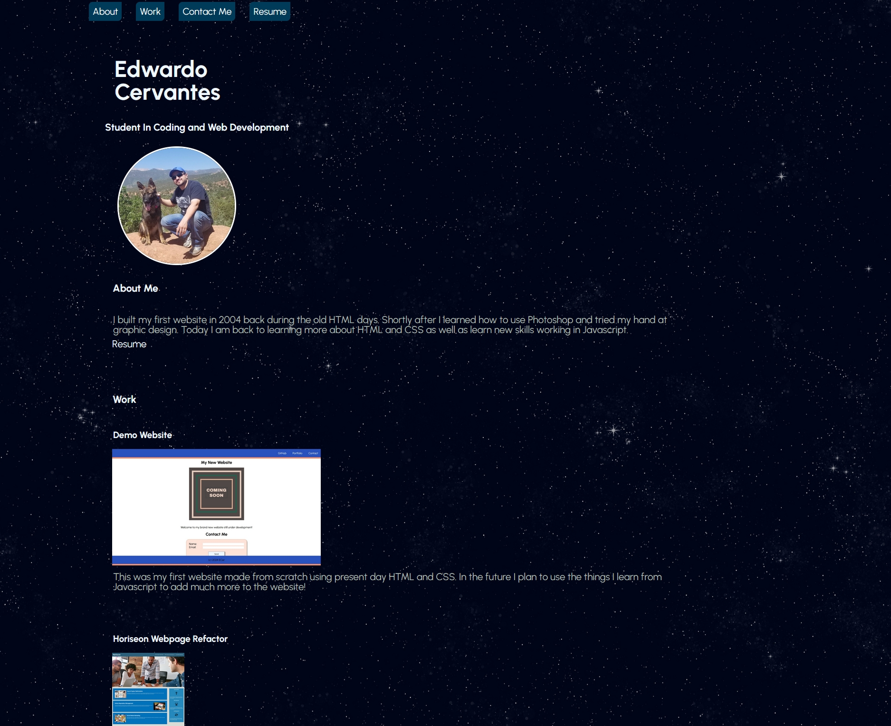

# Portfolio Page

## Description

This project is the initial creation of my Portfolio webpage and will contain all my experience, projects, contact info, resume, etc. The project was made with my knowledge of the CSS and HTML I have learned throughout the years and most recently from my Bootcamp course.

The navigation bar is interactive with CSS elements such as box shadow and a custom cursor I made in  for this webpage. In the future I hope to add a glow to the cursor using Javascript. Speaking of custom graphics, the background image for the webpage was also created in  specifically for this project.

I experimented with Flexbox to allow for the display of the main content of the page without interfering with the navigation menu. I learned much more of how Flexbox works during this project and can now visually see it in action mentally much better.

[Link to deployed application.](https://excervantes.github.io/portfolio-page/)

## Installation

N/A

## Usage

The upper section of the page contains an interactive navigation bar which link to the appropriate sections withing the page. Each image below the Works section will link to their respective pages.

### Example of Webpage

## Credits
N/A

## License

GNU GENERAL PUBLIC LICENSE
Version 3, 29 June 2007

See LICENSE for more info